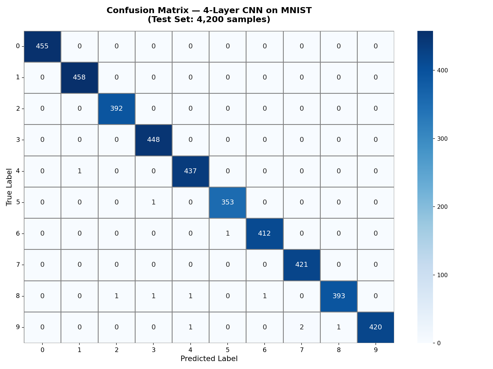
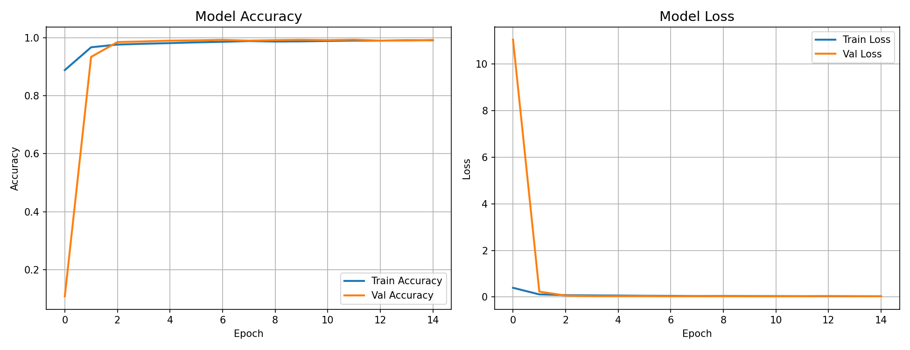

# ✍️ Handwritten Digit Recognition using CNN & ANN

> A real-time handwritten digit recognition system built with a 4-Layer CNN trained on the MNIST dataset — wrapped into a beautiful interactive web app using Streamlit.

## 🚀 Live Demo

| Feature | Description |
|---|---|
| ✏️ Draw on Canvas | Draw any digit (0–9) and get instant prediction |
| 📁 Upload Image | Upload a photo with multiple handwritten digits |
| 📊 Confidence Chart | See probability scores for all 10 digit classes |
| 🔢 Multi-digit Support | Detects and reads multiple digits from one image |

## 📊 Model Performance

| Metric | ANN | CNN |
|---|---|---|
| Training Accuracy | 96.38% | 99.76% |
| Test Accuracy | 96.10% | 99.79% |
| Total Errors (4200 samples) | ~168 | **9 only** |
| Inference Speed | ~15 FPS | **~30 FPS** |

### Confusion Matrix

### Training Curves

---

## 🏗️ Model Architecture

Input (28×28×1 Grayscale Image)
        ↓
Conv2D(32, 3×3) → BatchNorm → ReLU → MaxPool(2×2) → Dropout(0.25)
        ↓
Conv2D(64, 3×3) → BatchNorm → ReLU → MaxPool(2×2) → Dropout(0.25)
        ↓
Flatten → Dense(128) → BatchNorm → ReLU → Dropout(0.5)
        ↓
Dense(10, Softmax) → Predicted Digit

- **Optimizer:** Adam
- **Loss:** Categorical Cross-Entropy  
- **Epochs:** 15
- **Dataset:** MNIST (42,000 train / 4,200 test)

## 🛠️ Tech Stack

| Category        | Tools |
|----------       |---|
| Language        | Python 3.11 |
| Deep Learning   | TensorFlow 2.16, Keras |
| Computer Vision | OpenCV |
| Web App         | Streamlit, Streamlit-Drawable-Canvas |
| Visualization   | Plotly, Matplotlib, Seaborn |
| Data            | MNIST CSV (Kaggle) |

## ⚙️ Installation & Setup

### 1. Clone the repository

git clone https://github.com/11DDBOY11/Hand-Written-Digit-recognition-.git
cd Hand-Written-Digit-recognition-

### 2. Create virtual environment

python -m venv ml_env
ml_env\Scripts\activate        # Windows
source ml_env/bin/activate     # Mac/Linux

### 3. Install dependencies

pip install tensorflow==2.16.1 streamlit==1.32.0 opencv-python pillow numpy plotly streamlit-drawable-canvas

### 4. Train the model (generates digit_cnn_model.h5)

python train_model.py

### 5. Run the web app

python -m streamlit run appp.py

Open **http://localhost:8501** in your browser 🎉

## 📁 Project Structure

Hand-Written-Digit-recognition-/
│
├── appp.py                  # Streamlit web application
├── train_model.py           # CNN & ANN training script
├── predict_live.py          # OpenCV real-time prediction
├── confusion_matrix.py      # Confusion matrix generator
├── confusion_matrix.png     # Confusion matrix result
├── training_results.png     # Accuracy & loss curves
├── digit_cnn_model.h5       # Trained CNN model
└── README.md

## 🎯 Key Results

- ✅ **5 out of 10 digit classes** achieved **100% accuracy** (0, 1, 2, 3, 7)
- ✅ Only **9 misclassifications** out of 4,200 test samples
- ✅ All errors occurred between **visually similar digits** (8↔3, 9↔7)
- ✅ CNN outperformed ANN by **+3.38%** accuracy
- ✅ Real-time inference at **~30 FPS**

## 👥 Team

| Name            | USN |

| Darshan Dashyal | 4AL23CS035 |
| Darshan G M     | 4AL23CS036 |

**Guide:** Prof. Mahesh Kini M  
**Institution:** Alva's Institute of Engineering and Technology, Moodbidri  
**Course:** BCS602 — Machine Learning | 6th Semester | 2025–26

## 📜 License

This project is licensed under the MIT License — feel free to use and build upon it!

Made with ❤️ at AIET, Moodbidri
